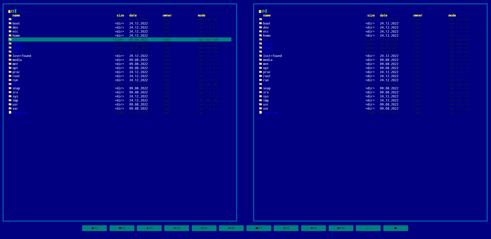
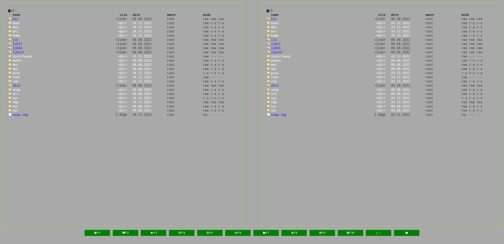
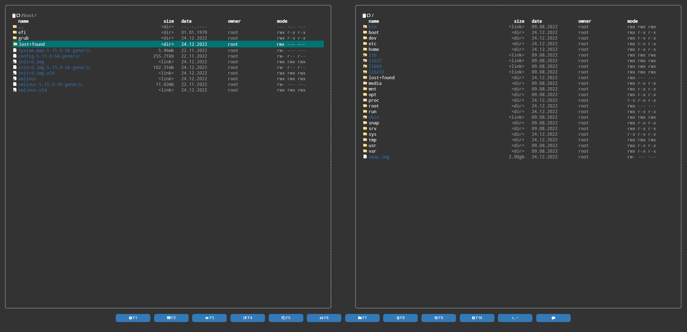

Themes
==============

Repo with themes for [Cloud Commander](http://cloudcmd.io/ "Cloud Commander").

#
## Installation
For now there is no easy way around this.
  - Copy the contents of the style you want in the `` section in `index.html`
  - OR copy the file in your directory and reference it in index.html

#
## List
 - [Far](far.css)
 
 - [Gray](grayStyle.css) (dev version)
 
 - [Dark](dark.css) (dark)
 

